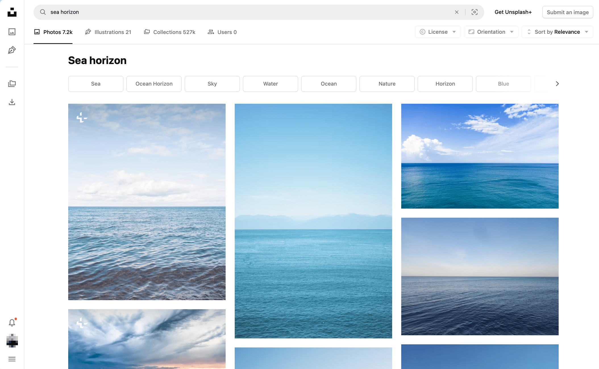
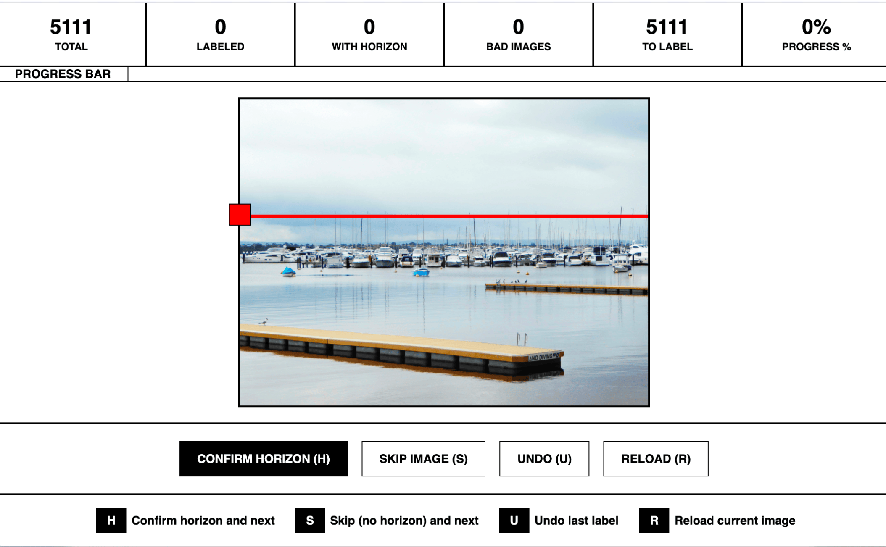
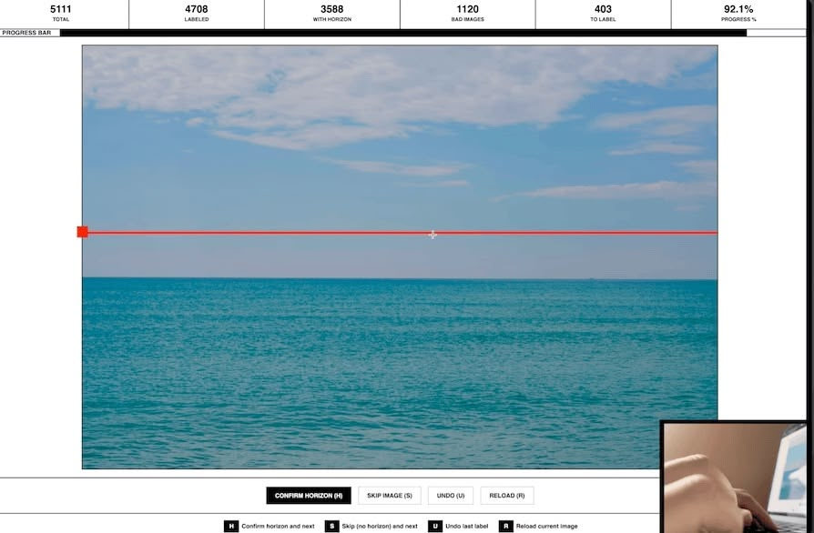
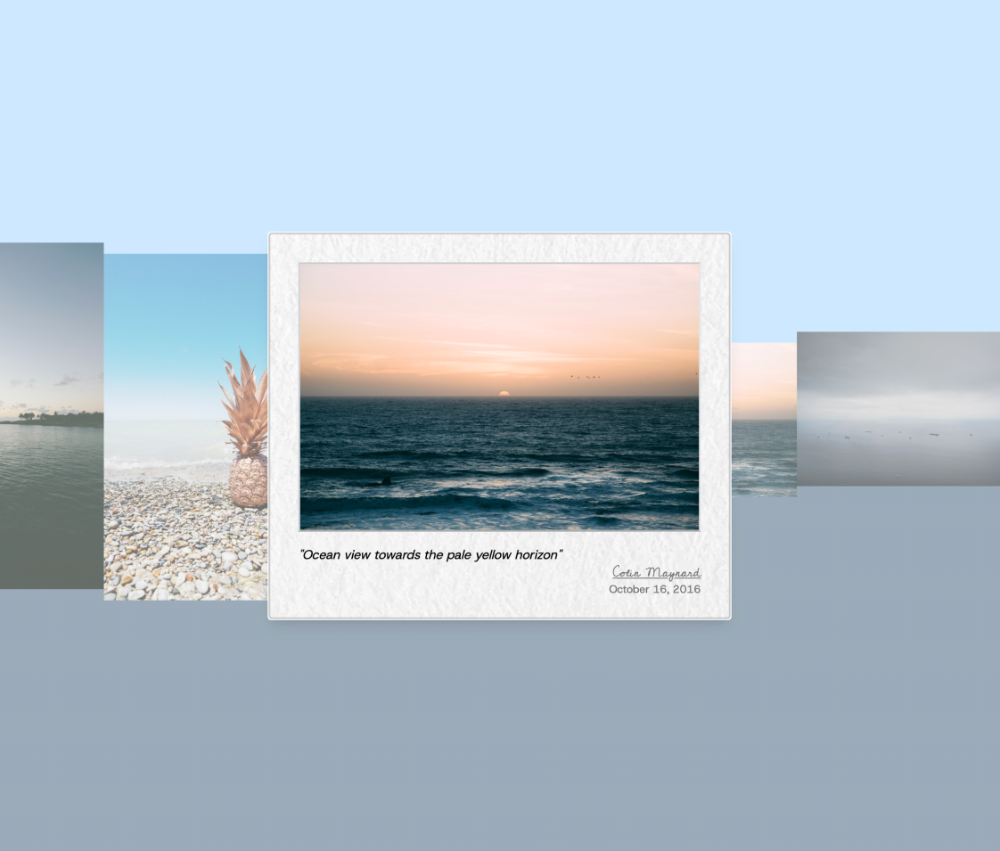
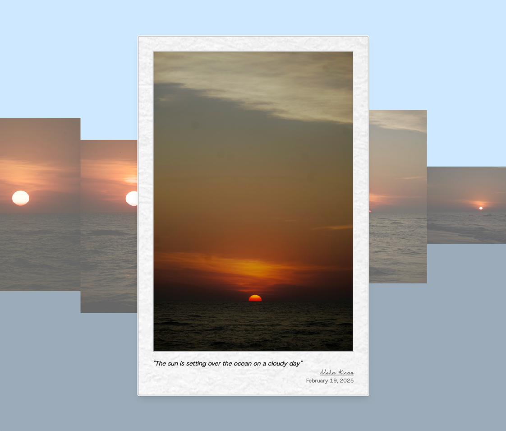
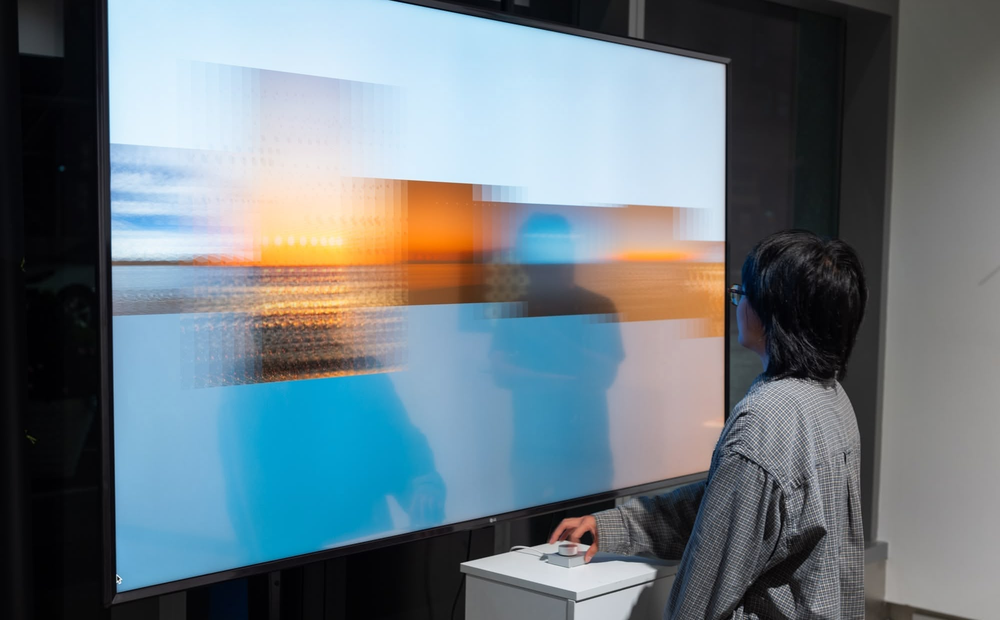
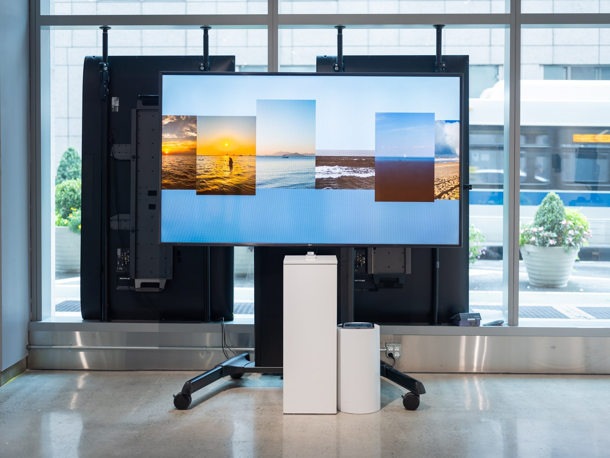
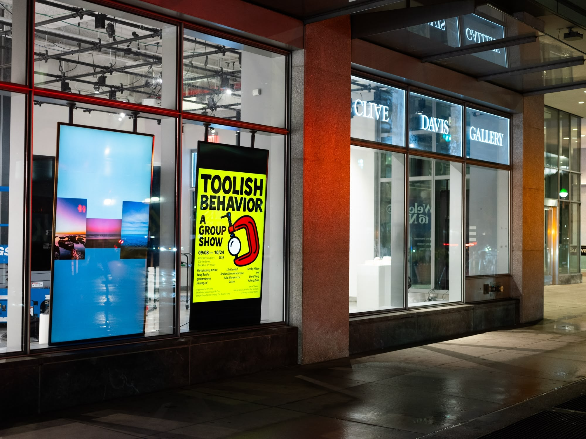

# Aligned Waters

A typological study of 'seascape' photographs from Unsplash. Horizons in each image are manually labeled and aligned to create a scrollable collection.

[Aligned Waters](https://aligned-waters.yufeng.place) collects 'seascape' photographs from Unsplash and presents them as a scrollable image collection.

<video width="100%" autoplay muted loop>
  <source src="./assets/aligned-water-doc-sm-compressed.mp4" type="video/mp4">
  Your browser does not support the video tag.
</video>

_Aligned Waters installation at Clive Davis Gallery_

## Process

From 5,111 search results for "sea horizon", I picked 3,152 images with a clear horizon line on both sides, and manually labeled the y-coordinate of the horizon line in each image.

_Unsplash search results for 'sea horizon'_

_Horizon Labeling Tool_

I built a custom web-based horizon labeling tool to label the horizon lines. The process takes about 2 hours.

_Watch the horizon labeling process_

Images are aligned by the horizons and ordered chronologically based on the user upload date.

_Panorama of aligned waters_

In the image set, the earliest image dates back to 2016.

_Details of a seascape image taken in 2016_

_Details of a seascape image taken in 2025_

For the installation, the scrolling is controlled by a knob.

_Aligned Waters installation in motion_

## Exhibition

_Aligned Waters installation at Clive Davis Gallery_

_Toolish Behavior at Clive Davis Gallery_

**2025** - [Toolish Behavior](https://www.instagram.com/p/DOXHk7KDNG5). Group exhibition at [Clive Davis Gallery](https://tisch.nyu.edu/clivedavisgallery.html), Brooklyn, NY.

Curated by [Shuang Cai](https://shuangcai.cargo.site/), the show features 11 artists and the tools they created, presenting both as equal parts of the creative process.
